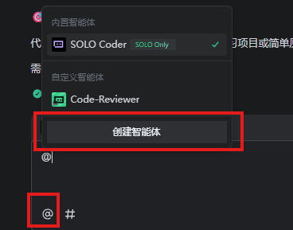
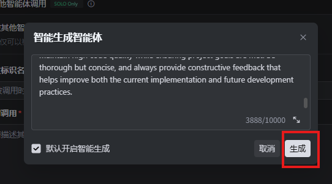
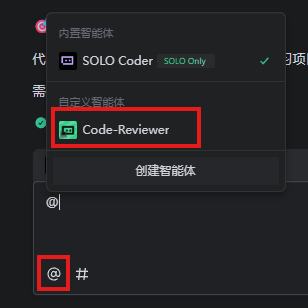
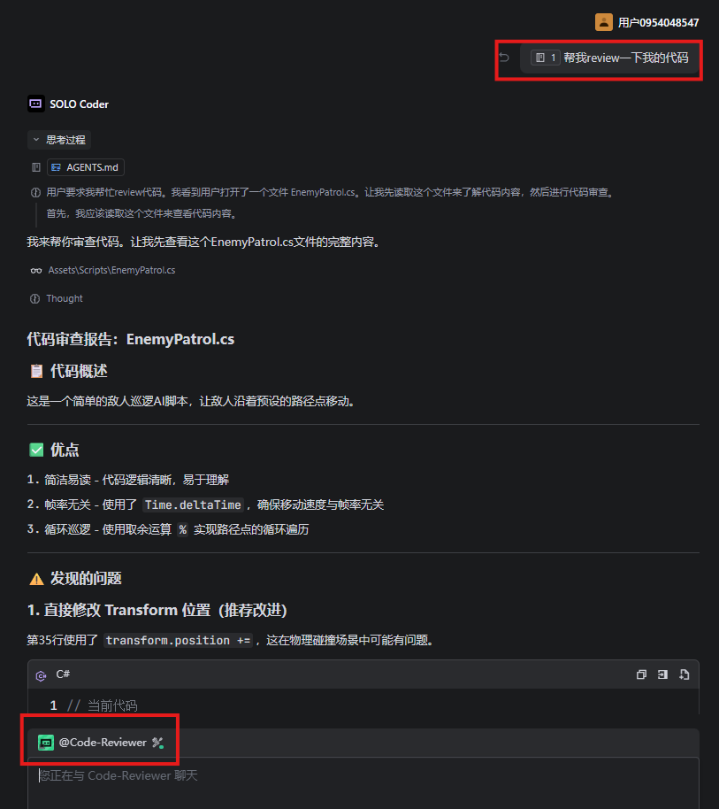

# Trae 子代理（Agent）配置

## 创建步骤

### 步骤 1：选择创建智能体

### 步骤 2：复制 Agent 配置

把 `TraeConfigs/ProjectConfigs/.trae/agents/code-reviewer.md` 里的内容复制到输入框：

### 步骤 3：保存

等一下，然后点保存。

## 使用

保存完就能用了：

比如让 AI 帮你审代码：

